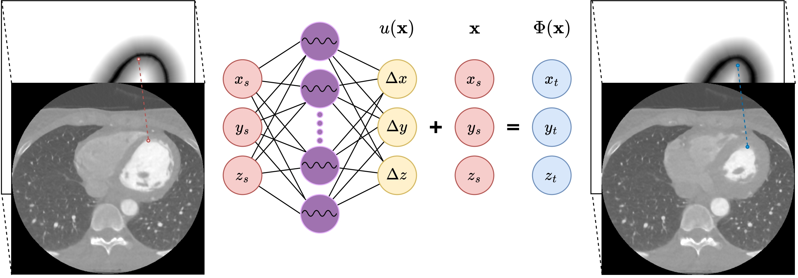

# INR_reg_LVmyo
Code our paper "Implicit Neural Representations for Registration of Left Ventricle Myocardium During a Cardiac Cycle".




# Running the code
You will need [PyTorch](https://pytorch.org/) to run the code and a CUDA-enabled GPU. 

Example of running the code:
```
python run_main.py --path path/to/files --has_metadata --sequential --sdf_alpha 0.8
```

# Reference
If you use this code, please cite our STACOM 2024 paper

    @inproceedings{lowes2024INRregLVmyo,
      title={Implicit Neural Representations for Registration of Left Ventricle Myocardium During a Cardiac Cycle},
      author={Mathias Micheelsen Lowes and Jonas Jalili Pedersen and  Bjørn S. Hansen and Klaus Fuglsang Kofoed and  Maxime Sermesant and Rasmus R. Paulsen},
      booktitle={Statistical Atlases and Computational Models of the Heart.}
      year={2024},
      publisher={Springer Nature Switzerland}
    }
